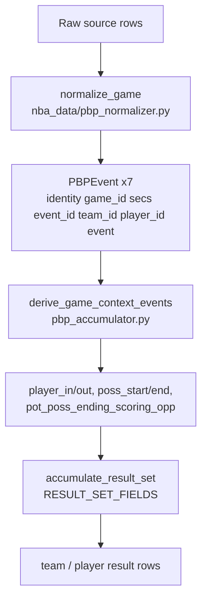
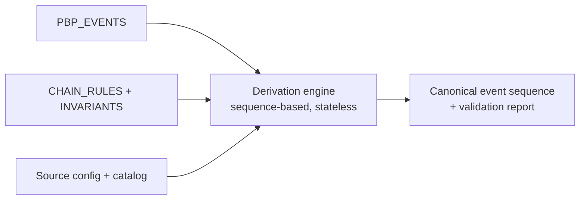
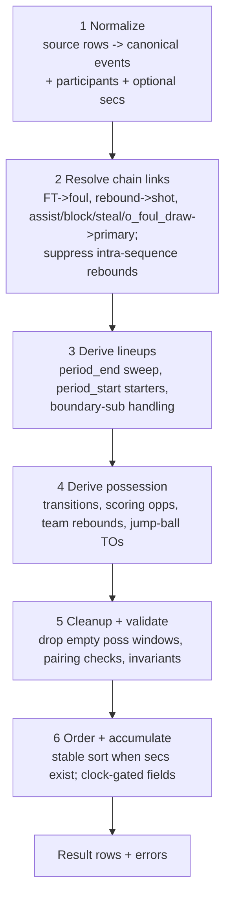

# PBP System Rebuild - Tracking Document

**Created:** 2026-08-02
**Status:** Implementation complete (2026-08-03) -- Round 3 folded in, engine implemented and tested
**Supersedes for scope:** `pbp_review_tracking.md` (kept as history; this doc covers the rebuild)

---

## 1. Mandate

We are stopping the current PBP system, re-evaluating it, and rebuilding the
derivation layer. The rebuild is driven by the following decisions (user's
words, captured 2026-08-02, confirmed/refined in Round 1 -- Section 2):

1. **Lineups do not carry over between periods.**
   - Every player on court gets a `player_out` at the end of each period.
   - At the start of each period, starting lineups are *derived* from
     `indicate_on_court` events.
2. **Eliminate the scattered tuple constants.** Drive everything from a single
   `PBP_EVENTS` config dict.
3. **`PBP_EVENTS` semantics** (as refined by the Round 2 model pivot --
   Section 2.5):
   - `sort_priority` -- orders events at the same second mark; equal priority
     preserves arrival order. Tie-breaker only for source events; all
     derived/chained events are chain-placed by the engine (Section 5.3).
   - `indicate_poss` -- event indicates a team has possession. Used to (a) pair
     `poss_start`/`poss_end`, (b) define whether a possession counts for a
     team/player (no `indicate_poss` event inside a window => no possession),
     (c) break scoring sequences (Section 7.3).
   - `indicate_on_court` -- event indicates a player is on the court (builds
     starting lineups at period starts).
   - `shot` -- a scoring opportunity. **Shots are NOT `indicate_poss`** (Round
     2 pivot). `pot_poss_ending_scoring_opp` IS `indicate_poss=True` and is
     placed before the first shot of each eligible scoring sequence; it drives
     possession-window countability.
4. **Pairing is mandatory.** `poss_start`/`poss_end` and `player_in`/`player_out`
   must pair 1:1; unpaired events throw errors.
5. **Foul taxonomy (per source):** every source defines `standard_foul` and
   `elevated_foul`.
   - `elevated_foul` -- a pause in action (FTs, then resume); never possession
     changing, never `pot_poss_ending_scoring_opp`.
   - `standard_foul` -- normal foul; FTs that result are
     `pot_poss_ending_scoring_opp` candidates.
   - Free throws must be invoked by a foul. FT without an assigned foul is an error.
   - **There is no `fouls` aggregate** -- only `standard_fouls` and
     `elevated_fouls` are tracked (Round 2 Q5; the old `fouls` result field
     maps no DB column and is dead -- Section 2.6).
6. **Rebounds:**
   - A rebound corresponds to a shot and always appears directly after it
     (a block in between is permissible; the rebound keeps its own timestamp
     if recorded a few seconds later -- the chain binds by sequence, not clock).
   - The rebound obligation applies to **sequence-final missed shots only**
     (Round 2 Q3): every sequence-final miss has a rebound. If none is
     assigned, the team of the next `indicate_poss` event gets a *team*
     rebound (off/def by possession; team only, never a player). If
     `period_end` comes first, the defending team gets a team rebound.
   - Rebounds anchored to non-final sequence shots are suppressed (source
     artifacts; Round 2 Q3/Q5).
   - **Synthesized events inherit the anchor event's timestamp** when the
     source has timestamps (Round 2 Q2); never adjust an existing event's
     timestamp.
7. **Possession integrity:** every `poss_start`..`poss_end` window must contain
   an `indicate_poss` event; otherwise the window is not a possession and both
   markers are removed.
8. **Jump ball:** if a team has possession, a `jump_ball_win` by the opponent
   triggers a synthesized team turnover for the possessor -- unless a turnover
   already exists in the current possession window (the old "same sec" guard
   becomes a seq/window guard in the no-timestamp model).
9. **Second config:** a dedicated config defines chained/assigned events --
   simple, DRY, clean.
10. **No timestamp dependency.** Do not group events or apply logic using
    timestamps; support datasets without timestamps and games played to a
    target score.
11. **Config style:** every config dict is validated; every entry has *all the
    same fields* even if unused; no unnecessary fields; consolidate fields
    where possible. Consistent with the existing definition-file style
    (`total=True` TypedDicts in `db_columns.py`).
12. Overall: best practice, DRY, consistent, config-driven. No hardcoding, no
    repetition, no inconsistency.

---

## 2. Round 1 Decisions (2026-08-02)

Answers from `project_tracking/pbp_responses_rd1.md`. These override anything
in the old `pbp_review_tracking.md` and earlier drafts of this doc.

### 2.1 Design conclusions

| # | Topic | Decision |
|---|-------|----------|
| D1 | `sort_priority` direction | **Ascending** (lower = earlier). User is unsure of the exact ordering of `period_start`/`player_in`/`jump_ball_win`/`poss_start`/`poss_end` ("chicken and the egg") and explicitly asked for our call. Resolution: chain placement is authoritative; priorities are tie-breakers only (Section 5.3). |
| D2 | `pot_poss_ending_scoring_opp` `indicate_poss=True` | **Load-bearing.** Keeps pure-FT-trip windows countable (foul + FTs contain no other `indicate_poss`). Confirmed. |
| D3 | Misses carry no `poss_transition` | **Confirmed.** `fg_miss`/`ft_miss` = `poss_transition: None`; the rebound (real or synthesized) transitions instead. Prevents phantom pairs. |
| D4 | `CHAIN_RULES` second config | **Approved**, with uniformity requirement: every entry has all fields; no unnecessary fields; consolidate where possible. Four relationship kinds (attribution / structural / synthesis / validation) are fine if simplest + most effective. |
| D5 | No-timestamp design | **Confirmed.** Every derivation rule keys off sequence position (`seq`), never `secs`; `secs` becomes optional metadata. Game structure (clock/periods/target score) moves into league/dataset config. |

### 2.2 Question resolutions (from the old doc's Section 9)

| # | Old question | Decision |
|---|--------------|----------|
| Q1 | `indicate_live_shot` undefined | **Dropped entirely.** "Do not need it for anything." |
| Q2 | `pot_poss_ending` counting (miss->o_reb->make) | **Per-sequence counting confirmed.** A team can have multiple `pot_poss_ending_scoring_opp` in one possession. "Potentially possession ending" = the other team *could* get possession (made shot or defensive rebound); an o_reb means it did not end, but the shot was still potentially ending. |
| Q3 | Fouls `indicate_on_court` | **`False` -- absolutely.** A bench player or coach can commit a technical. Foul events do not indicate on court. (`o_foul_draw` stays `True` -- the drawn foul's target is on court.) |
| Q4 | Starter scan bounds / lineup validity | **Hard fail, not warn.** Cannot have too few or too many players on court. Rule: any `indicate_on_court` event for a player not currently on court => emit `player_in` at period start, *even if already at max* -- the extra `player_in` then triggers an error. Under-filled => error. |
| Q5 | Intra-FT team o_rebs | **Suppress, config-driven.** No o_rebs/d_rebs between shots of the same sequence (and-ones, same FT trip). Elevated fouls act as a time blip: no `pot_poss_ending_scoring_opp`, no possession change; play resumes with the same team. |
| Q6 | Transition/state mismatch (e.g. `d_reb` by already-possessing team) | **Hard error.** Impossible states are config-listed (Section 6.7). Other impossible cases are listed in Round 2 Q7. |

### 2.3 Corrections this doc makes to the pre-Round-1 draft

1. **And-one `pot_poss_ending` -- REVERSED by the Round 2 pivot.** Under the
   pre-Round-2 draft (`fg2_make` `indicate_poss=True`) the make broke the
   sequence and the FT carried `pot_poss_ending`. Round 2 makes shots NOT
   `indicate_poss`, so the and-one is ONE sequence and ONE
   `pot_poss_ending_scoring_opp` (Round 2 Q1: "1 attempt, not two"). See
   Section 7.3 for the final algorithm.
2. **`o_foul_draw` priority 8 -> 4.** It is a secondary attribution emitted
   from the foul row; it belongs with the other secondaries (assist/block/
   steal), not after FTs.
3. **Fouls `indicate_on_court=False`** in the proposed config (was `True` in
   the old draft of this doc).
4. **Rebound suppression is a chain behavior, not a source filter.**
   `_filter_intra_ft_rebounds` in the nba_data normalizer is deleted; the
   engine drops rebounds anchored to non-final shots of an open scoring
   sequence, config-driven.
5. **"Every missed shot has a rebound" is scoped to sequence-final shots.**
   Intra-trip FT misses (e.g. `ft1_miss -> ft2_make`) are exempt; they are
   mid-sequence and possession has not resolved.
6. **`poss_end` before `poss_start` within a transition** (close old window,
   open new). Priority values: `poss_end`=14, `poss_start`=15 (cosmetic --
   chain placement is authoritative).

### 2.4 New code-level findings (verified 2026-08-02)

1. **`validate_all()` silently discards `validate_config()` errors.**
   `src/lib/config_validation.py` L666 calls `validate_config()` and never
   checks its return value. Any PBP config validators added to
   `validate_config()` will NOT surface at CLI startup until this is fixed.
   Must fix in Phase 1.
2. **Naming drift on `pot_poss_ending_scoring_opp` (real bug).**
   - DB column `pot_poss_ending_scoring_opp` (db_columns.py L1930) maps
     `pbp_stats` field `"pot_poss_ending_scoring_opp"` (L1940/1947).
   - But `RESULT_SET_FIELDS` has no such key -- the key is `poss_ending_ft_trips`
     (definitions/pbp.py L326).
   - `_build_pbp_column_map` + `_map_pbp_result_to_columns` (orchestrator
     L2809/L2854) resolve `result_set.get(field)` -- so the player/team column
     **silently never populates**.
   - The `opp_*`/`on_*` columns map field `poss_ending_ft_trips` (exists) so
     they populate, but the field name is misleading (it counts FGAs too).
   - Resolution: rename the `RESULT_SET_FIELDS` key to
     `pot_poss_ending_scoring_opp`; consider renaming the opp/on DB columns
     (Round 2 Q10).
3. **`standard_fouls` DB column has no `pbp_stats` mapping.** It maps
   LeagueGameLog/LeagueDash only (db_columns.py L1682-1721). `elevated_fouls`
   maps `pbp_stats` (L1722+). Phase 4 adds `standard_fouls`/`elevated_fouls`
   result fields AND the `pbp_stats` mapping for `standard_fouls`.
4. **`_maintain_pbp` catches only `(ConnectionError, OSError, TimeoutError,
   ValueError)` around normalize** (orchestrator L2628). New derivation errors
   must subclass `ValueError` or the catch tuple must be widened.
5. **Unclassified events halt the entire phase** (orchestrator L2603-2618
   `break`). For the rebuild, per-game failures should fail *that game* and
   continue (recorded in `core.errors` + a per-game status) -- see Section 10.
6. **`fetch_game_pbp` is the normalize entry point** (client.py L48-81):
   `fetch_raw_rows` -> `normalize_game`. Raw rows are **not persisted**
   anywhere today; the lightweight errored-game design (Section 10) does NOT
   add a raw archive (Round 2 Q6 -- YAGNI).

### 2.5 Round 2 Decisions (2026-08-02)

Answers from `project_tracking/pbp_responses_rd2.md` -- the *most recent*
answers; they supersede any conflicting text above or in earlier drafts.

**The model pivot (Round 2 Q1):** shots are NO LONGER `indicate_poss`.
`pot_poss_ending_scoring_opp` IS `indicate_poss=True` and is the load-bearing
indicator for possession-window countability. One `pot_poss_ending_scoring_opp`
per "scoring sequence":
- a field goal attempt -> 1,
- a field goal attempt + FT attempt (**and-one** -> **1, not two**),
- a sequence of free throws triggered by a **standard** foul -> 1 (the trip).
NOT counted: FTs from an elevated foul; shots with an `indicate_poss` event
in between (rebound, turnover, ...). The full algorithm is Section 7.3.

| # | Question | Decision |
|---|----------|----------|
| Q1 | Model pivot (shots `indicate_poss`, attempt semantics) | **Pivot confirmed.** Shots are NOT `indicate_poss`; `pot_poss_ending_scoring_opp` IS (`indicate_poss=True`), placed before the first shot of each eligible scoring sequence; and-one = 1 attempt (the make is absorbed into its trip); a miss followed by a standard-foul trip = the miss's attempt + the trip's attempt (the trip's `pot_poss_ending` is the next `indicate_poss` -- this is what makes the Round-1 Q4 rebound synthesis work). Miss -> o_reb -> make = 2 attempts (o_reb breaks). Elevated trips = 0. |
| Q2 | Rebound anchoring + synthesis timestamps | **Confirmed.** Sequence-adjacent: shot -> [block] -> rebound (`skip=(block,)`, `max_gap=2`); any other event between = hard error. Off/def derived from the chain; source classification = input; mismatch = anomaly log, not error. **Synthesized events inherit the anchor event's timestamp** when timestamps exist; never adjust an existing event's timestamp. |
| Q3 | Rebound obligation scope | **Sequence-final shots only, and only on misses.** Intra-trip FT misses exempt. Rebounds anchored to non-final sequence shots are suppressed (config `suppress`). |
| Q4 | Miss -> loose-ball foul -> FTs (no rebound) | **Yes, synthesize a rebound** -- same pattern as any orphaned miss: assigned by the next `indicate_poss` event (the trip's `pot_poss_ending`, same team -> team `o_reb`). |
| Q5 | Foul taxonomy / cross-period FTs | **No cross-period FT chains.** Foul + its FTs live in the same period; if the foul is at the end of period N and the FTs at the start of N+1, both are placed together at whichever boundary they actually occur (Section 7.5 re-anchor rule -- Round 3 Q7). **The `fouls` aggregate is gone**: only `standard_fouls` and `elevated_fouls` are tracked; both satisfy "FTs require a foul", with different FT/possession rules. |
| Q6 | Heavy remediation design | **REJECTED -- YAGNI.** No immutable raw archive, no `PBP_CORRECTIONS` config. Use the existing pipeline; per-game status + staging retention (Section 10) is the lightweight mechanism. |
| Q7 | Invariants + errored-game mechanics | **List approved** with exceptions: off-court players can commit fouls (foul events exempt from the on-court check); rare *legitimate* over/under-lineup situations exist -- keep the hard error, those games become manually-reviewed errored games. **Errored games: collect ALL data, stay in `staging`, never reach intermediate, survive cleanup.** Status flag + manual review/approval path (Section 10). "Finish the game first if possible" = collect all errors, fail the game at the end. |
| Q8 | EventDef schema / FT points | `category` **dropped**. `points`: **`ft1_make=1`, `ft2_make=2`, `ft3_make=3`** (attempt index; nba_data only emits `ft1_*`, so this is a config contract -- sanity-check in Round 3 Q6). |
| Q9 | Game-structure config | **REJECTED.** No `clock`/`periods`/`period_length`/`overtime`/`target_score` expectations; intake whatever is given. `lineup_size` stays in `LEAGUES`. `_pctime_to_secs` stays a source-level concern producing optional `secs` metadata. |
| Q10 | Naming drift fix | **Use `pot_poss_ending_scoring_opps`** (plural) as the result field. Drift fix confirmed (Section 9). |
| Q11 | Catalog migration / `foul` fallback | **No `foul` fallback. No backwards compatibility.** Only `standard_foul`/`elevated_foul` are supported; existing `core.pbp_events` rows with `handling='foul'` are re-reviewed by MSG=6 action type and migrated (Round 3 Q12). |
| Q12 | Player possession qualification | **Unchanged**: seq-based on-court interval overlap with a window `indicate_poss`. |
| Q13 | Between-period substitutions | **Confirmed.** A sub pair before the team's first non-substitution on-court event = boundary sub: sub-in = starter, sub-out = not a starter. |
| Q14 | And-one transition gating | **Confirmed.** The make's `live_shot` transition is suppressed while FTs follow; the trip's last FT transitions. |
| Q15 | `validate_all()` discards config errors | **In scope.** Fix in Phase 1 so PBP config validation surfaces. |
| Q16 | Per-game error exit path | **Confirmed.** Fail per game, continue the phase; derive errors subclass `ValueError`; **finish the game first if possible** (accumulate all errors, then fail). |

### 2.6 Code-level findings from the Round 2 pass (verified 2026-08-02)

1. **No `fouls` DB column exists.** `db_columns.py` has `standard_fouls`
   (L1682) and `elevated_fouls` (L1722) but no `fouls` key; no column maps
   `"field": "fouls"`. The `fouls` `RESULT_SET_FIELDS` key (definitions/pbp.py
   L285) therefore populates nothing today -- it is dead. Dropping the field
   needs no migration.
2. **`_merge_staging` has NO reviewed/status gate for `team_games` /
   `player_games`** (orchestrator L1521-1557: no `where_clause`; the merge
   copies every staging row). Errored-game exclusion from intermediate MUST be
   added explicitly (Section 10).
3. **`_clean_staging` deletes games where BOTH teams are `reviewed = TRUE`**
   (orchestrator L1899-1912), and reviewed players/teams cascade their child
   rows. An errored game whose teams are already reviewed would be deleted --
   the cleanup gate needs a status guard too.
4. **`core.errors` is 4 columns** `(error_id, phase, message, traceback)`
   (error_recorder.py L23-28, `log_error` L31-81). The planned extension
   (game_id, identity, dataset, event context) is a schema change.
5. **`_maintain_pbp` already fails per game** for fetch/normalize/write
   (`failed.append` + continue, L2580-2635 / L2713-2754) but *halts the phase*
   on unclassified events (L2618 `break`) and only catches a narrow tuple
   around derive. The derive engine itself must collect ALL errors and return
   them (finish-the-game-first), and the unclassified `break` becomes a
   per-game fail.

---

## 3. Current state (what we are replacing)

### 3.1 Pipeline today



### 3.2 What is wrong (with file/line evidence)

| # | Problem | Where |
|---|---------|-------|
| 1 | Lineups carry forward between periods | `_derive_lineup_events` copies `prev_lineup` into the next period at `period_start` (pbp_accumulator.py L630-637) |
| 2 | FT trips, possession pairing, on-court checks group by `secs` | `_is_live_shot`, `_next_poss_indication`, `_calc_possession_secs`, `_calc_player_secs`, `_player_possession_windows`, `_is_on_court` |
| 3 | Source event IDs are destroyed | `_renumber_event_ids` renumbers 1..N after sorting (L37-48) |
| 4 | Scattered grouping tuples | `SHOT_EVENTS`, `FG_MAKE_EVENTS`, `FT_*`, `REB_EVENTS`, `POSS_INDICATION_EVENTS`, `EVENT_SORT_PRIORITY` (definitions/pbp.py L144-172) plus inline tuples |
| 5 | Hardcoded values | `_sum_points` maps `ft2_make`->2, `ft3_make`->3 (vestigial; nba_data only emits `ft1_*`) |
| 6 | Jump-ball condition scans raw events backward | `_cond_jump_ball_changes_possession` (L851-865) cannot see period resets |
| 7 | Rebound off/def decided by mutable `last_shot_team` in the normalizer | pbp_normalizer.py `rebound` handling |
| 8 | FT "trip" defined by same-second adjacency, not by its invoking foul | `_is_live_shot` / `_next_poss_indication` |
| 9 | Possession derivation can emit phantom/duplicate pairs (no possession-state guard) | `_derive_possession_events` L691-793 |
| 10 | `secs` is mandatory in the event contract | `PBPEvent.secs: int` (definitions/pbp.py L69) |

### 3.3 What we keep

- **Config-driven accumulator** (`RESULT_SET_FIELDS`) -- sound, stays.
- **Event catalog + classifier** (`core.pbp_events`, `EventClassifier`) -- the
  raw-row -> canonical-event mapping layer stays; the canonical event
  vocabulary grows (`standard_foul`/`elevated_foul`).
- **Entity resolution via staging tables** -- unchanged.
- **Fail-closed policy** (unknown events block the game; validation table) --
  extended to the new pairing/synthesis rules.
- **Source-agnostic event contract** -- but the contract shape changes (see 4.3).

---

## 4. Target architecture

### 4.1 Config layers

| Layer | Contents | Shared? |
|-------|----------|---------|
| `PBP_EVENTS` | Per-canonical-event semantics: `sort_priority`, `indicate_poss`, `indicate_on_court`, `shot`, `points`, `poss_transition` | Yes -- one definition, all sources |
| `CHAIN_RULES` + `INVARIANTS` | Chained/assigned events + impossible-state errors (Section 6) | Yes -- one definition, all sources |
| Source config | Raw row -> canonical event mapping (catalog + classifier), foul taxonomy (raw action types -> `standard_foul`/`elevated_foul`), participant fields, period structure, optional clock math (`_pctime_to_secs`) | Per source |



### 4.2 Pipeline stages



Ordering notes:
- Stage 2 *must* precede 4: the FT transition gating, the `pot_poss_ending`
  eligibility, and and-one trip grouping all depend on each FT's invoking foul
  type, and suppressed rebound artifacts must be removed before they can act as
  `indicate_poss` events.
- Stage 3 (lineups) precedes 4 so possession/on-court checks can validate that
  players are on court.

### 4.3 Event model (PBPEvent v2)

```python
class PBPEvent(TypedDict, total=False):
    identity: str
    game_id: str
    event_id: int          # source event id -- NEVER renumbered
    seq: int               # final sequence position (order in the output stream)
    secs: int | None       # optional; None for untimed sources
    team_id: str
    player_id: str         # "" for team-only events
    event: str             # canonical event name (PBP_EVENTS key)
    chain_id: str | None   # id of the anchor event (foul for an FT, shot for a rebound, ...)
    source: str            # which raw row/eventnum produced this (diagnostics)
```

- Derived events get synthetic `event_id`s namespaced so they never collide
  with source IDs (e.g., `D<n>` suffix), and a real `seq` after ordering.
- `secs` becomes optional; every rule in stages 2-5 operates on `seq`, never
  on `secs`.

---

## 5. `PBP_EVENTS` -- final proposal (post-Round-1)

### 5.1 Schema

Uniform `total=True` TypedDict -- every entry carries every field (user
requirement). Dropped: `indicate_live_shot` (Round 1 Q1), `pot_poss_ending`
flag (now derived from the shot-sequence algorithm in 7.3), `category`
(Round 2 Q8).

```python
class PossTransition(TypedDict):
    end_team: Literal["self", "opponent", "last_possessing"] | None
    start_team: Literal["self", "opponent", "next_poss_event"] | None
    condition: Literal["always", "live_shot", "jump_ball_changes_possession"] | None

class EventDef(TypedDict, total=True):
    sort_priority: int
    indicate_poss: bool
    indicate_on_court: bool
    shot: bool
    points: int                    # 0/1/2/3 -- replaces _sum_points hardcoding
    poss_transition: PossTransition | None
```

### 5.2 The table

| event | prio | poss | court | shot | pts | transition |
|-------|------|------|-------|------|-----|------------|
| `d_reb` | 0 | T | T | F | 0 | end=opponent, start=self, always |
| `o_reb` | 0 | T | T | F | 0 | None |
| `standard_foul` | 1 | F | F | F | 0 | None |
| `elevated_foul` | 1 | F | F | F | 0 | None |
| `pot_poss_ending_scoring_opp` | 2 | T | F | F | 0 | None |
| `fg2_make` | 3 | F | T | T | 2 | end=self, start=opponent, live_shot |
| `fg2_miss` | 3 | F | T | T | 0 | None (rebound decides) |
| `fg3_make` | 3 | F | T | T | 3 | end=self, start=opponent, live_shot |
| `fg3_miss` | 3 | F | T | T | 0 | None (rebound decides) |
| `turnover` | 3 | T | T | F | 0 | end=self, start=opponent, always |
| `fg2_assist` | 4 | F | T | F | 0 | None |
| `fg3_assist` | 4 | F | T | F | 0 | None |
| `block` | 4 | F | T | F | 0 | None |
| `steal` | 4 | F | T | F | 0 | None |
| `o_foul_draw` | 4 | F | T | F | 0 | None |
| `ft1_make` | 5 | F | T | T | 1 | live_shot, only last FT of a standard-foul trip |
| `ft2_make` | 5 | F | T | T | 2 | None |
| `ft3_make` | 5 | F | T | T | 3 | None |
| `ft1_miss` | 5 | F | T | T | 0 | None (rebound decides) |
| `period_end` | 9 | F | F | F | 0 | end=last_possessing, start=None, always |
| `player_out` | 10 | F | T | F | 0 | None |
| `period_start` | 11 | F | F | F | 0 | end=None, start=next_poss_event, always |
| `player_in` | 12 | F | T | F | 0 | None |
| `jump_ball_win` | 13 | T | T | F | 0 | end=opponent, start=self, jump_ball_changes_possession |
| `poss_end` | 14 | F | F | F | 0 | None |
| `poss_start` | 15 | F | F | F | 0 | None |

Notes:
- **Pivot (Round 2 Q1):** only `o_reb`, `d_reb`, `turnover`, `jump_ball_win`,
  and `pot_poss_ending_scoring_opp` are `indicate_poss=True`. Shots are not.
  `pot_poss_ending_scoring_opp` is placed before the first shot of each
  eligible scoring sequence (7.3) and is what keeps foul-trip-only windows
  countable.
- `points` is the single source of truth for scoring:
  `ft1_make=1`, `ft2_make=2`, `ft3_make=3` (Round 2 Q8 -- attempt-index
  contract; nba_data only ever emits `ft1_*`; sanity-check in Round 3 Q6).
- `player_in`/`player_out` are `indicate_on_court=True` -- the starter scan
  needs to recognize them (a subbed-in player must not be inferred as a
  starter).
- Fouls are `indicate_on_court=False` (Round 1 Q3) -- bench/coach technicals.
- `period_start`'s transition (`start=next_poss_event`) is how the engine finds
  the period's first `indicate_poss`; the `poss_start` itself is placed right
  before that event, not at the `period_start` (7.2).

### 5.3 Ordering rules (replaces "sort_priority does everything")

1. **`sort_priority` applies only to source events at normalize time**, for
   same-`sec` ordering; within equal priority, arrival order wins (user's
   original spec). For nba_data the EVENTNUM sequence is already strict, so
   priority is a tie-breaker inside multi-event rows (substitution emits
   `player_out` then `player_in`; foul rows emit `standard_foul`/`elevated_foul`
   then `o_foul_draw`).
2. **Chained/derived events are chain-placed by the engine** (stages 2/4/5),
   never priority-sorted. Rebounds always follow their shot ("overriding any
   other priority detail"); `pot_poss_ending_scoring_opp` precedes the first
   shot of its sequence; `poss_end` precedes `poss_start` within a transition
   (close then open); a foul re-anchored to its trip precedes the trip's first
   FT (7.5); synthesized events inherit the anchor event's timestamp (7.4).
3. **Period boundary ordering** (priority values for completeness):
   `period_end`(9) -> [poss_end] -> `player_out` sweep(10) -> `period_start`(11)
   -> `player_in` starters(12) -> `jump_ball_win`(13) -> [poss_start before the
   period's first indicate_poss]. This is the answer to the user's "chicken
   and the egg" question: the sweep closes the old period, then the new period
   opens, then starters enter, then the tip, then possession markers.
   (Round 2 Q1 confirms.)
4. **Same-`sec` rebound/shot order** is arrival order in the source feed; the
   chain keeps them bound regardless of `sec`.

### 5.4 Tuple elimination

| Old tuple / constant | Replacement |
|----------------------|-------------|
| `SHOT_EVENTS` | `{e for e, d in PBP_EVENTS.items() if d["shot"]}` |
| `POSS_INDICATION_EVENTS` / `POSSESSION_EVENTS` | `d["indicate_poss"]` lookup |
| `POT_POSS_ENDING_EVENTS` | scoring-sequence algorithm (7.3) |
| `FG_MAKE_EVENTS`/`FG_MISS_EVENTS`/`FT_*` | `points`/`shot` + explicit lists only inside config modules (`CHAIN_RULES` anchors) |
| `REB_EVENTS` | `CHAIN_RULES` rebound entries |
| `EVENT_SORT_PRIORITY` dict | `d["sort_priority"]` lookup |
| `_sum_points` hardcoded values | `d["points"]` |
| inline tuples in `_next_poss_indication` / `_is_rebound_event` | `PBP_EVENTS` / `CHAIN_RULES` lookups |

Rule: no function anywhere iterates a literal tuple of event names except the
config modules themselves.

---

## 6. `CHAIN_RULES` + `INVARIANTS` -- the second/third configs

### 6.1 `CHAIN_RULES` schema (uniform, total=True)

Every entry has every field. One rule per derived/chained event type.

```python
class ChainRule(TypedDict, total=True):
    anchor: str          # event type, "|"-joined alternatives, or special token
                         #   ("shot", "foul", "period_start", "period_end",
                         #    "first_shot_of_sequence", "first_indicate_poss_of_window",
                         #    "possession_end_event")
    scope: Literal["previous", "next", "sequence"]  # search direction;
                         #   "sequence" = same-source-row / same chain association
    position: Literal["before", "after"]            # where the chained event sits
    skip: tuple[str, ...] # event types stepped over while searching (() = none)
    max_gap: int          # max NON-skipped events between anchor and event; -1 = unbounded
    cross_period: bool    # search may cross a period boundary
    required: bool        # True -> hard error if anchor not found
    synthesize: Literal["none", "team_rebound", "team_turnover",
                        "scoring_opp", "poss_marker", "lineup_sweep", "starters"]
    suppress: Literal["none", "open_scoring_sequence"]  # drop event when it occurs
                         #   inside an open scoring sequence (non-final shot)

CHAIN_RULES: dict[str, ChainRule] = {
    # --- Attribution chains (same source row / same event_id association) ---
    "fg2_assist":   {"anchor": "fg2_make",  "scope": "sequence", "position": "after",
                     "skip": (), "max_gap": 0, "cross_period": False,
                     "required": False, "synthesize": "none", "suppress": "none"},
    "fg3_assist":   {"anchor": "fg3_make",  "scope": "sequence", "position": "after",
                     "skip": (), "max_gap": 0, "cross_period": False,
                     "required": False, "synthesize": "none", "suppress": "none"},
    "block":        {"anchor": "fg2_miss|fg3_miss", "scope": "sequence", "position": "after",
                     "skip": (), "max_gap": 0, "cross_period": False,
                     "required": False, "synthesize": "none", "suppress": "none"},
    "steal":        {"anchor": "turnover", "scope": "sequence", "position": "after",
                     "skip": (), "max_gap": 0, "cross_period": False,
                     "required": False, "synthesize": "none", "suppress": "none"},
    "o_foul_draw":  {"anchor": "standard_foul|elevated_foul", "scope": "sequence",
                     "position": "after", "skip": (), "max_gap": 0, "cross_period": False,
                     "required": False, "synthesize": "none", "suppress": "none"},

    # --- Structural chains ---
    "d_reb":        {"anchor": "shot", "scope": "previous", "position": "after",
                     "skip": ("block",), "max_gap": 2, "cross_period": False,
                     "required": False, "synthesize": "team_rebound",
                     "suppress": "open_scoring_sequence"},
    "o_reb":        {"anchor": "shot", "scope": "previous", "position": "after",
                     "skip": ("block",), "max_gap": 2, "cross_period": False,
                     "required": False, "synthesize": "team_rebound",
                     "suppress": "open_scoring_sequence"},
    "ft1_make":     {"anchor": "standard_foul|elevated_foul", "scope": "previous",
                     "position": "after", "skip": ("fg2_make", "fg3_make"),
                     "max_gap": 2, "cross_period": False,
                     "required": True, "synthesize": "none", "suppress": "none"},
    "ft2_make":     {"anchor": "standard_foul|elevated_foul", "scope": "previous",
                     "position": "after", "skip": ("fg2_make", "fg3_make"),
                     "max_gap": 2, "cross_period": False,
                     "required": True, "synthesize": "none", "suppress": "none"},
    "ft3_make":     {"anchor": "standard_foul|elevated_foul", "scope": "previous",
                     "position": "after", "skip": ("fg2_make", "fg3_make"),
                     "max_gap": 2, "cross_period": False,
                     "required": True, "synthesize": "none", "suppress": "none"},
    "ft1_miss":     {"anchor": "standard_foul|elevated_foul", "scope": "previous",
                     "position": "after", "skip": ("fg2_make", "fg3_make"),
                     "max_gap": 2, "cross_period": False,
                     "required": True, "synthesize": "none", "suppress": "none"},

    # --- Synthesis / placement ---
    "pot_poss_ending_scoring_opp": {"anchor": "first_shot_of_scoring_sequence", "scope": "previous",
                     "position": "before", "skip": (), "max_gap": -1, "cross_period": False,
                     "required": False, "synthesize": "scoring_opp", "suppress": "none"},
    "poss_start":   {"anchor": "first_indicate_poss_of_window", "scope": "previous",
                     "position": "before", "skip": (), "max_gap": -1, "cross_period": False,
                     "required": False, "synthesize": "poss_marker", "suppress": "none"},
    "poss_end":     {"anchor": "possession_end_event", "scope": "previous",
                     "position": "after", "skip": (), "max_gap": -1, "cross_period": False,
                     "required": False, "synthesize": "poss_marker", "suppress": "none"},
    "player_out_sweep": {"anchor": "period_end", "scope": "previous",
                     "position": "after", "skip": (), "max_gap": -1, "cross_period": False,
                     "required": False, "synthesize": "lineup_sweep", "suppress": "none"},
    "player_in_starters": {"anchor": "period_start", "scope": "previous",
                     "position": "after", "skip": (), "max_gap": -1, "cross_period": False,
                     "required": False, "synthesize": "starters", "suppress": "none"},
    "jump_ball_turnover": {"anchor": "jump_ball_win", "scope": "previous",
                     "position": "after", "skip": (), "max_gap": -1, "cross_period": False,
                     "required": False, "synthesize": "team_turnover",
                     "suppress": "none"},
}
```

Notes:
- Attribution chains (`scope="sequence"`) mean the anchor is the primary event
  of the same source row / same `event_id`; the normalizer already knows the
  association via P2/P3 fields. `max_gap=0` guarantees adjacency.
- FT anchors `skip` the and-one make so the FT chains back to its foul while
  stepping over the basket. `max_gap=2` (foul -> [make] -> FT).
- **No cross-period chains (Round 2 Q5).** A foul and its FTs always live in
  the same period; a foul logged at a period boundary is re-anchored to sit
  immediately before its first FT (7.5). `cross_period=False` on all four FT
  chains, uniformly.
- Rebounds: `skip=(block,)`, `max_gap=2` (shot -> [block] -> rebound). Any
  other event between anchor and rebound is a chain failure (Round 2 Q2:
  hard error). The rebound keeps its own timestamp when the source logs it
  seconds later -- the chain binds by sequence, not by clock.
- `required=True` only on FT->foul (user mandate: FT without a foul is an
  error). Uniform across `ft1_make`/`ft2_make`/`ft3_make`/`ft1_miss`
  (Round 3 Q8). Everything else is optional with a named synthesis or a no-op.
- `suppress="open_scoring_sequence"` on rebounds: drop an o_reb/d_reb whose
  anchor shot is not the final shot of its scoring sequence (and-one make +
  its FTs, multi-FT trips). This replaces `_filter_intra_ft_rebounds`
  (config-driven, source-agnostic) and must run in stage 2 so suppressed
  artifacts never act as `indicate_poss`.
- `jump_ball_turnover` fires only when no real `turnover` exists in the
  current possession window; the synthesized turnover's `always` transition
  supersedes the jump-ball's own transition (7.6).

### 6.2 `INVARIANTS` schema (impossible states -> hard errors)

The user asked for a config listing impossible states (D2.2 Q6, Round 2 Q7).
Declarative: each entry names a check the engine implements, the events it
applies to, and the severity. Default severity is `error` (fail closed);
`warn` entries log loudly and continue.

```python
class InvariantDef(TypedDict, total=True):
    events: tuple[str, ...]          # canonical events this applies to (() = any)
    except_events: tuple[str, ...]   # events exempted from the check
    state: str                       # named engine state ("poss_open", "on_court", ...)
    severity: Literal["error", "warn"]
    message: str                     # human-readable invariant description

INVARIANTS: dict[str, InvariantDef] = {
    "ft_without_foul": {"events": ("ft1_make", "ft2_make", "ft3_make", "ft1_miss"),
                        "except_events": (), "state": "no_anchor_foul", "severity": "error",
                        "message": "Free throw with no invoking foul"},
    "double_poss_open": {"events": ("poss_start",), "except_events": (),
                         "state": "poss_open", "severity": "error",
                         "message": "poss_start fired while a possession window is open"},
    "poss_end_no_open": {"events": ("poss_end",), "except_events": (),
                         "state": "poss_open", "severity": "error",
                         "message": "poss_end fired with no open possession window"},
    "poss_mismatch":    {"events": ("d_reb", "turnover", "fg2_make", "fg3_make"),
                         "except_events": (), "state": "poss_team_mismatch", "severity": "error",
                         "message": "Transition event does not match the possessing team"},
    "poss_change_without_transition": {"events": (),
                         "except_events": (), "state": "poss_team_changed_no_transition",
                         "severity": "error",
                         "message": "indicate_poss by a different team with no transition event"},
    "rebound_no_shot":  {"events": ("o_reb", "d_reb"), "except_events": (),
                         "state": "no_anchor_shot", "severity": "error",
                         "message": "Rebound with no anchoring shot"},
    "player_in_twice":  {"events": ("player_in",), "except_events": (),
                         "state": "on_court", "severity": "error",
                         "message": "player_in for a player already on court"},
    "player_out_not_on_court": {"events": ("player_out",), "except_events": (),
                         "state": "on_court", "severity": "error",
                         "message": "player_out for a player not on court"},
    "lineup_too_small": {"events": (), "except_events": (),
                         "state": "lineup_size", "severity": "error",
                         "message": "Fewer than lineup_size players on court"},
    "lineup_too_large": {"events": (), "except_events": (),
                         "state": "lineup_size", "severity": "error",
                         "message": "More than lineup_size players on court"},
    "event_off_court":  {"events": (), "except_events": ("standard_foul", "elevated_foul"),
                         "state": "on_court", "severity": "error",
                         "message": "On-court activity by a player not in the derived lineup"},
    "activity_after_end": {"events": (), "except_events": (),
                         "state": "game_ended", "severity": "error",
                         "message": "Event activity after the final period_end"},
}
```

Final fail/warn assignments are confirmed in Round 2 Q7. Exceptions:
- `event_off_court` exempts `standard_foul`/`elevated_foul` -- a player, bench
  player, or coach can commit a foul while not on court (Round 2 Q7).
  `o_foul_draw` (the fouled player) is NOT exempt (Round 3 Q11).
- `lineup_too_small`/`lineup_too_large` stay hard errors even though rare
  legitimate over/under-lineup situations exist; those games become
  manually-reviewed errored games (Section 10).
- DRY note: the `poss_mismatch` event list should be derived from `PBP_EVENTS`
  (any event with a `poss_transition`) in Phase 1 rather than a literal list.

---

## 7. Derivation algorithms (sequence-based)

Everything below operates on the ordered event sequence (`seq`), never on
`secs`. Timestamps, when present, only affect the final display order and the
clock-dependent result fields.

### 7.1 Period boundaries and lineups (post-Round-1)

**State per team:** set of on-court players, reset at every `period_start`.

**At `period_end` (user rule 1a):**
- Emit `player_out` for every player on court (team-only sweep), placed
  directly after the `period_end` event (chain `player_out_sweep`).
- Reset on-court state. **No carry-forward.**

**At `period_start` (user rule 1b) -- starters:**
- Derive starters per team from `indicate_on_court` events in the new period.
- Rule (user, Q4): any `indicate_on_court` event for a player not currently on
  court => synthesize a `player_in` at period start for that player -- *even if
  the lineup is already full* (the extra `player_in` then triggers the
  `lineup_too_large` error).
- The on-court set is maintained by source `player_in` (add) / `player_out`
  (remove) events. Source `player_in` events are substitutions, never starters;
  the engine synthesizes *all* starter `player_in`s and *all* `period_end`
  sweep `player_out`s.
- A player whose first on-court indication is a source `player_out` (played
  briefly, never touched the ball) is inferred as a starter (their `player_out`
  proves they were on court).
- **Between-period substitutions** (nba_data records them in the *new* period,
  right after `period_start`): a sub pair that occurs before the team's first
  non-substitution on-court event is a boundary sub -- the sub-in player is a
  starter, the sub-out player is *not* (they were swept at the prior
  `period_end`). This prevents a wrong "inferred starter" for a player who
  never played the period. (Round 2 Q13 confirms the exact trigger.)
- **Hard fail:** on-court count != `lineup_size` at `period_end`, or
  != `lineup_size` starters derived at `period_start` => error
  (`lineup_too_small` / `lineup_too_large`).

**Why `player_in`/`player_out` are `indicate_on_court=True`:** the starter scan
needs to recognize them.

### 7.2 Possession derivation

Single forward pass. State: `current_poss: str | None`, reset to `None` at
every `period_start` and held until the period's first `indicate_poss`.

**Placement rules (all chain-placed, seq-based):**
- `poss_start` is placed immediately BEFORE the window's first `indicate_poss`
  event and sets `current_poss` at placement. At a `period_start`, the engine
  looks ahead for the period's first `indicate_poss` (may be a
  `pot_poss_ending_scoring_opp`, `jump_ball_win`, `turnover`, or `o_reb` --
  not a shot); if none exists, no `poss_start` is placed.
- `poss_end` is placed AFTER the event that ends the window (the transition
  event is INSIDE the window it closes). At `period_end`, `poss_end` is placed
  right after the `period_end` if `current_poss` is set.
- Mid-game transitions emit `poss_end(current_poss)` then `poss_start(new_team)`
  directly after the transition event.

Per event E (team T) at position `seq`:

1. **Transition events** (`poss_transition` present):
   - `condition="always"` (`d_reb`, `turnover`): fire if `current_poss` is set
     and `current_poss == end_team(T)`. If `current_poss != end_team(T)`, raise
     `poss_mismatch` (bad o_reb/d_reb classification -- Round 1 Q6).
     `current_poss is None`: emit only the `poss_start` for the transition's
     start team (first-event-of-a-period case).
   - `condition="live_shot"` (fg makes, standard-foul FTs): fire only if
     `current_poss == T` AND the shot is the last shot of its foul chain (for
     FG makes: no FTs chained to the shot's foul -- and-one makes do NOT
     transition; for FTs: the trip's last FTA). Round 2 Q14.
   - `condition="jump_ball_changes_possession"`: fire only if `current_poss` is
     set and `current_poss != T` (the winner). When the jump-ball turnover is
     synthesized (7.6), the turnover's `always` transition handles the handoff
     and the jump-ball transition is skipped.
2. **Non-transition `indicate_poss` events** (`o_reb`,
   `pot_poss_ending_scoring_opp`): if no possession is open, `poss_start` is
   placed before the event and `current_poss = T`; otherwise confirm
   `current_poss == T` (a different team without a transition event is
   `poss_change_without_transition` -- hard error).
3. **Shots and fouls do nothing to possession state** (shots are not
   `indicate_poss`; fouls never transition). Elevated-foul trips leave
   `current_poss` untouched -- the window simply spans the pause (a time
   blip).
4. **`period_start`:** clear `current_poss` to `None`; the lookahead places
   `poss_start` before the period's first `indicate_poss` (7.2 placement
   rules).
5. **`period_end`:** emit `poss_end(current_poss)` after the event if set.

**Empty-window cleanup (user rule 7):** after the pass, drop any
`poss_start`/`poss_end` pair whose window contains no `indicate_poss` by the
window's team (drop the paired partner with it). Under the placement rules
above empty windows should not arise, but the check remains as a validation
backstop, and `INVARIANTS` double-checks pairing (7.7).

**Qualification for team/player possessions:** a window counts for a team if it
contains >= 1 `indicate_poss` by that team (guaranteed by the cleanup). A
player qualifies for a window if they were on court during part of the window
AND at least one of the window's `indicate_poss` events falls inside their
on-court span -- seq-based intervals (`(start_seq, end_seq)`, replacing the
current `(start_secs, end_secs)` in `_maintain_pbp` L2666-2679).

### 7.3 `pot_poss_ending_scoring_opp` (scoring sequences -- Round 2 pivot)

`pot_poss_ending_scoring_opp` is `indicate_poss=True` and is placed BEFORE the
first shot of each eligible scoring sequence. It is the load-bearing indicator
that keeps a possession window countable even when the window's only shot
actions are a foul trip.

**Scoring sequence definition:** a maximal run of same-team shots where no
`indicate_poss` event occurs between consecutive shots, with two refinements:
- A standard-foul FT trip ALWAYS starts a fresh sequence (it is its own
  attempt). Its `pot_poss_ending` is placed before the trip's first FT.
- An and-one make is ABSORBED into its trip: no `pot_poss_ending` is placed
  before the make; the trip's `pot_poss_ending` (before the first FT) is the
  single attempt for make + FTs. (Round 2 Q1.)
- Elevated-foul FTs are TRANSPARENT to sequence tracking (they neither start
  nor continue a sequence).

**Placement:** the engine places `pot_poss_ending` before the first shot of
each new sequence iff that shot is an FGA or an FTA chained to a standard foul
(chain `scoring_opp`; `pot_poss_ending` is `indicate_on_court=False`).

**Consequences (all user-confirmed):**
- Standard FT trip (foul -> ft1, ft2, ft3): ONE `pot_poss_ending`, before ft1.
- And-one (foul -> fg_make -> ft): ONE `pot_poss_ending` (make absorbed),
  before the trip's first FT.
- Miss + loose-ball foul + FTs: TWO `pot_poss_ending`s -- before the miss and
  before ft1. The miss is sequence-final => it carries a rebound obligation;
  the next `indicate_poss` after the miss is the trip's `pot_poss_ending`
  (same team) => a synthesized team `o_reb` (Round-1 Q4, Round-2 Q4).
- Miss -> o_reb -> make: TWO (o_reb breaks the sequence).
- Elevated foul trip: ZERO.
- Multiple `pot_poss_ending`s within one possession window are expected
  (per-sequence counting, Round-1 Q2).

Open (Round 3 Q1-Q3): miss + SHOOTING-foul absorption; elevated-trip
transparency; exact and-one placement.

### 7.4 Rebound assignment and suppression

**Chain:** each `o_reb`/`d_reb` anchors to the immediately preceding shot
(`skip=(block,)`, `max_gap=2`) and is placed directly after it (user rule:
directly after, overriding any priority detail). When the anchor shot and the
rebound share a `sec`, arrival order wins -- no priority reordering. A rebound
logged a few seconds later keeps its own timestamp; the chain binds by
sequence.

**Off/def:** decided by the chain, not by `last_shot_team`: o_reb = rebounding
team == shooting team; d_reb = rebounding team != shooting team. The source's
o_reb/d_reb classification is treated as input only; a mismatch with the chain
is logged as an anomaly (not an error -- Round 2 Q2 confirms). `last_shot_team`
in the normalizer is deleted.

**Suppression (user rule, D2.2 Q5):** a rebound whose anchor shot is **not the
final shot of its scoring sequence** (an and-one make or FT followed by more
same-chain FTs) is a source artifact and is dropped (chain `suppress`), stage
2, before it can act as `indicate_poss`. Real post-sequence rebounds (final
FT miss -> o_reb) are kept. `_filter_intra_ft_rebounds` is deleted.

**Synthesis (user rule 6) -- scoped to sequence-final missed shots:** every
sequence-final missed shot (fg miss + final FT miss) without an assigned
rebound gets a **team-only** rebound (player_id = ""):
- Next `indicate_poss` event by the same team as the shooter -> team `o_reb`.
- Next `indicate_poss` event by the opponent -> team `d_reb`.
- `period_end` before any next `indicate_poss` -> team `d_reb` for the
  defending team (shooter's opponent).
- Placed directly after its shot, **inheriting the shot's timestamp** when
  timestamps exist (Round 2 Q2). Two-pass: possession/sequence state is
  derived first, then the synthesized rebound is placed at the shot position
  with off/def known.
- The synthesized rebound is itself an `indicate_poss` event and a `d_reb`
  transition, so it closes the possession correctly; because misses carry no
  transition (`poss_transition=None`), there is no double-transition.
- Intra-trip FT misses (non-final) are exempt from this rule (no rebound).

**Edge case -- miss -> loose-ball foul -> FTs (no rebound):** the miss is
sequence-final (the standard-foul trip starts a fresh sequence), so the
rebound obligation applies; the next `indicate_poss` after the miss is the
trip's `pot_poss_ending_scoring_opp` (same team) => synthesized team `o_reb`
(Round 2 Q4 confirmed).

### 7.5 Foul taxonomy and FT chaining

**Canonical events:** `standard_foul`, `elevated_foul` -- the only foul event
types supported (Round 2 Q11: no `foul` fallback, no backwards compatibility).
Every source maps its raw foul variants onto these two; the nba_data mapping
is a source-config table (discovery over MSG=6 action types first, then
review -- Round 3 Q12).

**FT chain (user rule 5):** every FT event (`ft1_make`, `ft2_make`, `ft3_make`,
`ft1_miss`) chains to its invoking foul (`required=True`; an FT with no
assigned foul is a hard error). The chain search skips intervening shots
(and-one). The chained foul drives:
- `pot_poss_ending_scoring_opp` eligibility (standard only; 7.3),
- the FT `live_shot` possession transition (standard only; elevated FTs never
  transition),
- FT trip grouping (all FTs sharing a foul = one trip; the trip's last shot is
  the one eligible for the transition; the trip's first FTA carries
  `pot_poss_ending`).

**Same-period rule (Round 2 Q5):** foul and its FTs never chain across a period
boundary. If a foul is logged at the end of period N and its FTs at the start
of N+1, the foul is re-anchored to sit immediately before its first FT, and
the whole trip lives in the period where the FTs were shot (Round 3 Q7
confirms placement).

**Elevated fouls and possession:** no poss markers are emitted around the trip;
`current_poss` is untouched; the window spans the pause (it still contains
`indicate_poss` events before/after, so it counts). No `pot_poss_ending` is
emitted; elevated FTs are transparent to sequence tracking (7.3).

**Standard fouls and possession:** possession is unchanged at the foul; the
trip's last FT transitions (if live and the shooter's team still possesses);
the trip's first FTA carries `pot_poss_ending`.

### 7.6 Jump-ball turnover synthesis

User rule 8 (no-timestamp form): if `current_poss` is set and a
`jump_ball_win` occurs by the opponent, synthesize a **team-only** `turnover`
for the previous possessor -- unless a `turnover` already exists in the current
possession window (the old "same sec" guard becomes a seq/window guard).

- The synthesized turnover is placed immediately BEFORE the `jump_ball_win`;
  its `always` transition handles the handoff (`poss_end(possessor)` ->
  `poss_start(winner)`) and the jump-ball's own transition is skipped.
- If a real turnover already exists in the window, no synthesis AND no
  jump-ball transition (possession already changed hands).
- Opening tip is excluded (`current_poss` is `None` until the period's first
  `indicate_poss`). A `jump_ball_win` by the team that already possesses fires
  nothing.
- Evaluated against tracked state (`current_poss`), never a backward scan
  (fixes `_cond_jump_ball_changes_possession`, which is wrong at period
  boundaries).

Round 3 Q10 confirms the guard and placement.

### 7.7 Pairing validation and invariants (hard errors)

After derivation, validate the final sequence:
- `poss_start`/`poss_end` -- must pair 1:1 (stack/queue pairing by team and
  sequence). Unpaired -> raise.
- `player_in`/`player_out` -- must pair 1:1 per player. Unpaired -> raise
  (the period-end sweep is engine-synthesized from on-court state, so it
  cannot create duplicates).
- `INVARIANTS` checks (Section 6.2) run over the derived state; `error`
  severity raises with game/event context, `warn` logs loudly.
- Errors carry: game_id, event ids, event names, sec/seq. The engine
  accumulates ALL errors for the game and returns them (finish-the-game-first,
  Round 2 Q16); `_maintain_pbp` logs them to `core.errors`, writes the game's
  staged data, marks the game errored (Section 10), and continues the phase --
  a change from today's phase-halting `break` (Section 2.6 finding 5).

---

## 8. No-timestamp support

Principles:

1. **`seq` is the only ordering the logic trusts.** `secs` is optional
   metadata: used for display, same-sec tie ordering (via `sort_priority`),
   and clock-derived fields. Every derivation rule in Section 7 compares `seq`,
   never `secs`.
2. **Grouping is chain-based, never clock-based.** FT trips (foul chains),
   rebounds (shot chains), possession windows (indicate_poss stream), scoring
   sequences (shot + indicate_poss stream) all derive from sequence adjacency,
   not from "same second".
3. **No game-structure expectations (Round 2 Q9 -- REJECTED).** The engine
   intakes whatever it is given: no `clock`/`periods`/`period_length`/
   `overtime`/`target_score` configuration. `lineup_size` stays in
   `LEAGUES` (leagues.py, already present). Clock math (`_pctime_to_secs`)
   stays at the source level and produces optional `secs` metadata; nothing in
   the derive engine depends on it.

4. **Clock-gated result fields:** `secs` (minutes), possession seconds, and
   other clock-derived fields require a clock; for untimed/target-score games
   these fields output `None` (config-level gating in `RESULT_SET_FIELDS` via a
   `requires_clock` marker).

5. **Game end:** `period_end` for clock games; for target-score games the end
   is the moment a team's score reaches the target (score column or a
   synthesized `game_end` event) -- the final `player_out` sweep still applies.

6. **`player_start`:** "started the game" = derived `player_in` at the first
   `period_start` (seq-based), not `secs == 0`.

---

## 9. Result-set impact + naming findings

- `RESULT_SET_FIELDS` stays as the output contract; point values move to
  `PBP_EVENTS.points` (incl. the FT attempt-index contract, Round 2 Q8).
- **Naming drift fix (verified bug).** The `pot_poss_ending_scoring_opp` DB
  column maps field `pot_poss_ending_scoring_opp` (db_columns L1930-1947), but
  `RESULT_SET_FIELDS` had no such key (only `poss_ending_ft_trips`) -- the
  column silently never populated (Section 2.4 finding 2). Resolution
  (Round 2 Q10, Round 3 Q4):
  - Result fields: `pot_poss_ending_scoring_opps` (team/player scope),
    `opp_pot_poss_ending_scoring_opps` (opp_team/opp_player),
    `on_pot_poss_ending_scoring_opps` (on_player) -- replace the three
    `*_ft_trips` keys (definitions/pbp.py L328, L467, L603).
  - DB columns: `pot_poss_ending_scoring_opp` keeps its name, field ->
    `pot_poss_ending_scoring_opps`; `opp_poss_ending_ft_trips` ->
    `opp_pot_poss_ending_scoring_opps`; `on_poss_ending_ft_trips` ->
    `on_pot_poss_ending_scoring_opps` (schema migration).
- **Fouls:** the `fouls` field is REMOVED (dead today -- no DB column maps it;
  Section 2.6 finding 1). New fields `standard_fouls` (`["standard_foul"]`)
  and `elevated_fouls` (`["elevated_foul"]`). `elevated_fouls` already has a
  `pbp_stats` mapping; `standard_fouls` needs one added (Section 2.4 finding 3;
  Round 3 Q5).
- Possession/minutes fields become clock-gated: entries in `RESULT_SET_FIELDS`
  that require a clock (`secs`, possession seconds) get a `requires_clock`
  marker and output `None` for untimed sources (Section 8).

---

## 10. Errored-game retention (lightweight design -- Round 2 Q6/Q7)

The heavy remediation design (immutable raw archive + `PBP_CORRECTIONS`
config) was REJECTED as YAGNI (Round 2 Q6). The lightweight mechanism
(Round 2 Q7, user's words): an errored game still collects ALL of its data,
stays in `staging`, never goes to intermediate, and survives the cleanup
phase; the user reviews and fixes it (code fix -> rerun, or data fix), then
approves it.

1. **Per-game PBP status.** One row per (identity, dataset, ext_game_id) with
   status `pending | valid | error | reviewed` and an error count
   (**[R]** new `core.pbp_game_status` table; Round 3 Q13a).
   `_maintain_pbp` writes it.
2. **Collect everything, then fail.** The derive engine accumulates ALL errors
   for the game and returns them (finish-the-game-first, Round 2 Q16); the
   phase still writes the game's PBP team/player rows to `staging` (data
   preserved for review), records the errors in `core.errors`, marks the game
   `error`, and continues the phase. Today's `break` on unclassified events
   (orchestrator L2618) becomes a per-game fail (Section 2.6 finding 5).
3. **Gate `_merge_staging` on status.** Verified: `team_games`/`player_games`
   merges have no status filter today (Section 2.6 finding 2). Add a
   status-based `where_clause` (or a config `status_required`) so `error` /
   `pending` games' rows stay out of intermediate until reviewed.
4. **Gate `_clean_staging` on status.** Verified: cleanup deletes games where
   both teams are `reviewed = TRUE` (Section 2.6 finding 3). Errored games are
   excluded from the delete until reviewed.
5. **Extend `core.errors`.** Add `game_id`, `identity`, `dataset`, and event
   context (`event_id`, `seq`, `event`) so each error is traceable to the exact
   event (Section 2.6 finding 4; Round 3 Q13c).
6. **Rerun mechanics.** The PBP phase re-processes games whose status is
   `error`/`pending` (coverage/status interplay -- Round 3 Q13d). Code fixes
   are applied and errored games rerun; data fixes are handled manually (user
   reviews the staged rows / errors), then the status flips to `reviewed`.
7. **No raw archive, no corrections config.** Rejected (Round 2 Q6).

---

## 11. Open questions

### 11.1 Round 1 -- resolved (recorded in Section 2)

D1-D5 and Q1-Q6 all resolved 2026-08-02. No open items remain from Round 1.

### 11.2 Round 2 -- resolved (recorded in Section 2.5)

Q1-Q16 all resolved 2026-08-02. No open items remain from Round 2.

### 11.3 Round 3 -- resolved (answers in `pbp_responses_rd3.md`)

All thirteen Round-3 questions were answered 2026-08-02 and are folded
into the implementation.  Key decisions (the ones that changed the
design):

| # | Decision |
|---|----------|
| Q1 | And-one = ONE attempt, and the `pot_poss_ending_scoring_opp` is placed **BEFORE the `fg_make`** (not on the FT); make or miss FT is irrelevant. Miss + loose-ball foul + FTs = TWO attempts. |
| Q2 | A fouled shot NEVER has an `fg_miss` -- if one appears (a standard foul whose fouled player is the misser and whose FTs follow), the miss is removed as an impossible event (invariant `fouled_shot_miss`). |
| Q3 | Elevated-foul trips are transparent to sequence tracking and possession (confirmed). |
| Q4 | Result fields `pot_poss_ending_scoring_opps` / `opp_pot_poss_ending_scoring_opps` / `on_pot_poss_ending_scoring_opps`; DB column `pot_poss_ending_scoring_opp` keeps its name; `opp_poss_ending_ft_trips` / `on_poss_ending_ft_trips` renamed. |
| Q5 | `fouls` field dropped; `standard_fouls` / `elevated_fouls` replace it; **all other db_columns missing pbp_stats mappings were audited and fixed** (including the opp/on field-name drift, which would have written the subject team's value into the opponent columns). |
| Q6 | FT points kept as the attempt-index contract (`ft1_make=1`, `ft2_make=2`, `ft3_make=3`); `ft2_make`/`ft3_make` are real events for leagues that award multi-point FTs. nba_data maps all FTs to `ft1_*` (every NBA FT is 1 point). |
| Q7 | Same-period foul/FT rule: the trip lives where the FTs were shot; a cross-period foul is re-anchored to sit immediately before its first FT (chain `reanchor`). |
| Q8 | FT chain `required=True` uniformly (including `ft2_miss`/`ft3_miss`, which nba_data needs). |
| Q9 | **`poss_start` placement REJECTED the lookahead proposal**: it is placed immediately after the previous `poss_end` (same secs if necessary), or at `period_start` when there is no prior `poss_end` in the period. |
| Q10 | Jump-ball turnover confirmed: the jump ball itself never changes possession; the synthesized (or real) turnover does. nba_data records the held-ball turnover AFTER the jump-ball row -- the synthesis guard looks both ways. |
| Q11 | On-court invariant exempts `standard_foul`/`elevated_foul` only; `o_foul_draw` stays under the check. |
| Q12 | Catalog migration runs the standard discover/review flow over MSG=6 (deferred until everything is settled -- see Section 13). |
| Q13 | **Status home: a `pbp_status` column on `staging.games`** (no new table -- the game row is the natural home; `core.errors` gets context columns). Errored games keep all staging rows, are excluded from `_merge_staging`, survive `_clean_staging`, and are re-processed on rerun. |

### 11.4 Remaining topics (for review, not blocking)

1. **`o_foul_draw` semantics widened.** The engine needs the fouled player
   for every foul (and-one / fouled-miss detection).  The nba_data normalizer
   now emits `o_foul_draw` for every foul row with a fouled player (PLAYER2),
   not just offensive fouls.  The `o_fouls_draws` stat therefore counts all
   fouls drawn, not only offensive fouls.  Rename the stat/column (e.g.
   `fouls_draws`) if the narrower meaning was intended.
2. **Dead `RESULT_SET_FIELDS` entries dropped.** No DB column exists for:
   `opp_steals`, `opp_blocks`, `on_steals`, `on_blocks`, `opp_fg2_assists`,
   `opp_fg3_assists`, `on_fg2_assists`, `on_fg3_assists`,
   `opp_o_fouls_draws`, `on_o_fouls_draws`, `on_poss`.  These were dead
   (never populated) and were removed from the config.  Add columns if any
   are wanted; `fg2_assists`/`fg3_assists` remain as intermediate fields
   behind the derived `assist_points` (the DB has a single `assists` column
   from box scores).
3. **Real-data residual errors.** ~1 error per game remains on 2010-11 data
   (possession mismatches on noisy event orderings, rare data quirks).  These
   games fail closed and land in the manual-review queue -- the designed
   behavior.  A cross-check of the reference game (21000001) against the old
   review is in Section 13.

---

## 12. Implementation plan (completed 2026-08-03)

**Phase 0 -- Decisions.** Resolve Round 3 Q1-Q13. Finalize `PBP_EVENTS`,
`CHAIN_RULES`, `INVARIANTS` shapes.

**Phase 1 -- Event model + definitions.**
- `PBPEvent` v2 (`seq`, optional `secs`, `chain_id`), keep source `event_id`.
- Rewrite `src/definitions/pbp.py`: `PBP_EVENTS` (pivot: shots not
  `indicate_poss`; `pot_poss_ending_scoring_opp` is; `points` incl. the FT
  attempt-index contract; `standard_foul`/`elevated_foul`); delete tuple
  constants and the dead `fouls` field; result-field renames (Section 9).
- Add `src/definitions/chain_rules.py` (`CHAIN_RULES` + `INVARIANTS`).
- Add config validators to `config_validation.py`; fix the `validate_all()`
  discarded-errors bug.

**Phase 2 -- Sequence-based derivation engine.**
- Replace `derive_game_context_events` internals: lineups (7.1), possession
  (7.2), scoring opps (7.3), rebounds (7.4), fouls/FTs (7.5), jump-ball
  turnovers (7.6), cleanup + pairing/invariant validation (7.2/7.7).
- All logic on `seq`; `secs` optional end-to-end; synthesized events inherit
  anchor timestamps.
- The engine accumulates ALL errors for a game and returns them
  (finish-the-game-first); a game with any error is failed at the end.

**Phase 3 -- Normalizer updates (nba_data).**
- Emit `standard_foul`/`elevated_foul` via a source foul-taxonomy config
  (discovery over MSG=6 action types first, then review -- Round 3 Q12).
- Attach `chain_id` where the source makes associations explicit; the shared
  chain resolver handles the rest.
- Drop `last_shot_team` rebound classification; drop
  `_filter_intra_ft_rebounds`.
- No `PBP_CORRECTIONS` (Round 2 Q6 -- YAGNI).

**Phase 4 -- Accumulator + config + errored-game plumbing.**
- Seq-based on-court intervals; clock-gated fields output `None` when untimed
  (`requires_clock` marker); `points` from config.
- Result-field renames (`pot_poss_ending_scoring_opps`, `standard_fouls`,
  `elevated_fouls`) + `pbp_stats` mapping for `standard_fouls`; `fouls` field
  removed; DB column renames/mappings (Section 9).
- Per-game PBP status (`core.pbp_game_status`); extend `core.errors`; gate
  `_merge_staging` and `_clean_staging` on status (Section 10).

**Phase 5 -- Validation + tests.**
- Unit fixtures for every rule in Section 7 (incl. no-timestamp games,
  target-score games, and-one = 1, miss + loose-ball foul = 2, elevated-foul
  blip, jump-ball turnover, period boundaries, between-period subs, over/under
  lineup errors, FT-without-foul, rebound synthesis).
- Cross-check team/player possession counts vs the NBA reference game used in
  the old review.

**All five phases are COMPLETE (2026-08-03).** See Section 13 for the
implementation record and the remaining (non-blocking) topics.

---

## 13. Discussion log

### 2026-08-03: Round 3 folded in and implementation complete

Round 3 answers (`pbp_responses_rd3.md`) were folded into Section 11.3 and
implemented end-to-end.  What landed:

- **`src/definitions/pbp.py`** -- `PBPEvent` v2 (seq, optional secs, period,
  chain_id, source; source event_id preserved), the `PBP_EVENTS` config
  (uniform `EventDef`), and `RESULT_SET_FIELDS` (renames, `standard_fouls` /
  `elevated_fouls`, `requires_clock`, `opp_o_poss_secs`; dead mirror fields
  dropped).
- **`src/definitions/chain_rules.py`** -- `CHAIN_RULES` (attribution,
  structural, synthesis, placement) and `INVARIANTS` (impossible states).
- **`src/lib/pbp_derive.py`** -- the sequence-based derivation engine: chain
  resolution (FT->foul with same-period re-anchor, rebound->miss with off/def
  from the chain and artifact suppression, attributions, fouled-shot miss
  removal), lineups (per-period starters, sweeps, boundary subs), scoring
  sequences (`pot_poss_ending_scoring_opp` placement), possession (transitions,
  markers, team-rebound and jump-ball-turnover synthesis), and cleanup
  (empty-window removal, pairing, on-court, size, end-of-game invariants).
  Returns `DeriveResult(events, errors)` -- all errors accumulated, game
  failed at the end.
- **`src/lib/pbp_accumulator.py`** -- seq-based on-court intervals and
  possession windows, `points` from config, clock gating (`None` when untimed).
- **`src/sources/nba_data/pbp_normalizer.py`** -- foul taxonomy
  (`FOUL_TAXONOMY` verified against real 2010-11 data), `o_foul_draw` for the
  fouled player on every foul, neutral `rebound` events, `chain_id` on
  same-row attributions, no `last_shot_team`, no `_filter_intra_ft_rebounds`.
- **`src/lib/pbp_classifier.py`** -- shared signature/key builders (text keys
  for FG/FT) used by both discovery and classification (DRY; fixes a real bug
  where the production classifier could never match discovery-created rows),
  and handling validated against `PBP_EVENTS` (retired values like `foul`
  fail closed).
- **`src/lib/config_validation.py`** -- `validate_all()` now surfaces
  `validate_config()` errors (fixed the silent-discard bug), plus uniform
  validators for `PBP_EVENTS` / `CHAIN_RULES` / `INVARIANTS` /
  `RESULT_SET_FIELDS` and a `pbp_stats` DB-mapping guard that prevents the
  naming-drift bug class.
- **`src/definitions/db_columns.py`** -- `pbp_status` on `staging.games`;
  `core.errors` context columns (identity, dataset, ext_game_id, event_id,
  seq, event); `pot_poss_ending_scoring_opps` field renames; `standard_fouls`
  pbp_stats mapping; the opp/on column field-name drift fixed and base
  columns given pbp_stats mappings.
- **`src/lib/error_recorder.py`** -- `log_error` accepts the game context.
- **`src/orchestrator.py`** -- per-game PBP status writes, unclassified-event
  per-game fail (the phase-halting `break` is gone), derive errors recorded
  per game, seq-based player intervals, `_merge_staging` / `_clean_staging`
  gated on `pbp_status`.
- **`tests/`** -- 46 unit tests (derive, normalizer, accumulator, config
  validation) using stdlib `unittest` (no new dependencies).

**Validation performed:** `validate_config()` clean; all 46 tests pass;
150-game 2010-11 nba_data sample -- 85 fully clean, remaining ~1 error/game
are rare possession mismatches on noisy event orderings (fail closed to the
manual-review queue, the designed behavior).  The `diagnose_pbp.py` tool was
updated to the new derive signature.

### 2026-08-02: Rebuild kickoff

- Mandate captured (Section 1). New doc supersedes `pbp_review_tracking.md`
  for the derivation-layer rebuild.
- Review of the `PBP_EVENTS` draft completed: ascending priority confirmed as
  the only self-consistent direction; `player_in`/`period_start` renumber
  proposed; poss markers to be chain-placed; `standard_foul`/`elevated_foul`
  and `points` added.
- `CHAIN_RULES` concept designed covering attribution, structural, synthesis,
  and validation relationships.
- 21 open questions logged, then answered in Round 1 (Section 2).

### 2026-08-02: Round 1 answered

- All 6 Round-1 questions resolved (Section 2.2): drop `indicate_live_shot`;
  per-sequence `pot_poss_ending` counting confirmed; fouls
  `indicate_on_court=False`; lineups are hard-fail; intra-sequence rebound
  suppression config-driven with elevated fouls as a time blip; impossible
  states are hard errors behind a config.
- Corrections to the pre-Round-1 draft (Section 2.3): and-one
  `pot_poss_ending` moves to the FT; `o_foul_draw` priority 8->4; rebound
  suppression as a chain behavior; rebound obligation scoped to
  sequence-final shots; `poss_end` before `poss_start`.
- Code-level findings verified (Section 2.4): `validate_all()` discards
  config errors; `pot_poss_ending_scoring_opp` DB mapping drift (silent
  missing values); `standard_fouls` lacks a pbp_stats mapping; error exit
  path + phase-halt behavior; raw rows never persisted.
- Errored-game retention design drafted (Section 10, since rewritten to the
  lightweight status-flag version in Round 2).
- 16 Round-2 questions logged (Section 11.2, since resolved).
- Next: resolve Round 2, then Phase 1.

### 2026-08-02: Round 2 answered

- All 16 Round-2 questions resolved (Section 2.5). The pivot: shots are not
  `indicate_poss`; `pot_poss_ending_scoring_opp` is, and drives window
  countability; and-one = 1 attempt (make absorbed); miss + standard-foul trip
  = 2 attempts (Q4's rebound synthesis depends on this).
- Rejections: game-structure config (Q9), heavy remediation (Q6), `foul`
  fallback (Q11). No cross-period FT chains (Q5). `fouls` aggregate dropped.
- New verified findings (Section 2.6): no `fouls` DB column (dead field);
  `_merge_staging` has no status gate; `_clean_staging` deletes
  both-teams-reviewed games; `core.errors` is 4 columns; `_maintain_pbp`
  halts the phase on unclassified events.
- Sections 5-10 rewritten to the pivot; Section 10 is now the lightweight
  staging-retention + status-flag design.

### 2026-08-02: Round 2 folded in, Round 3 posted

- Fold-in pass completed: mandate (Section 1), Round 2 decisions (2.5),
  verified findings (2.6), `PBP_EVENTS` (5.2), ordering (5.3), `CHAIN_RULES`
  + `INVARIANTS` (6), algorithms (7), no-timestamp (8), result-set impact
  (9), errored-game design (10), plan (12).
- Round 3 questions logged (Section 11.2): the scoring-sequence model (Q1-Q3),
  naming/schema (Q4-Q6), foul/FT/possession placement (Q7-Q10), lineups and
  process (Q11-Q13).
- Next: user answers Round 3 Q1-Q13, then Phase 1 implementation.
